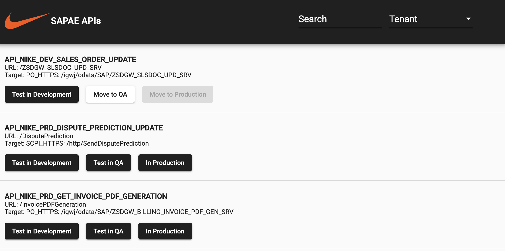
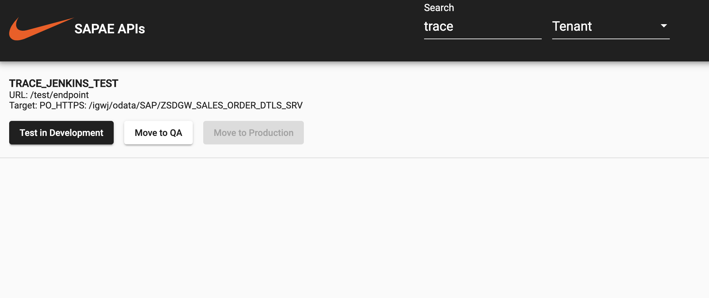
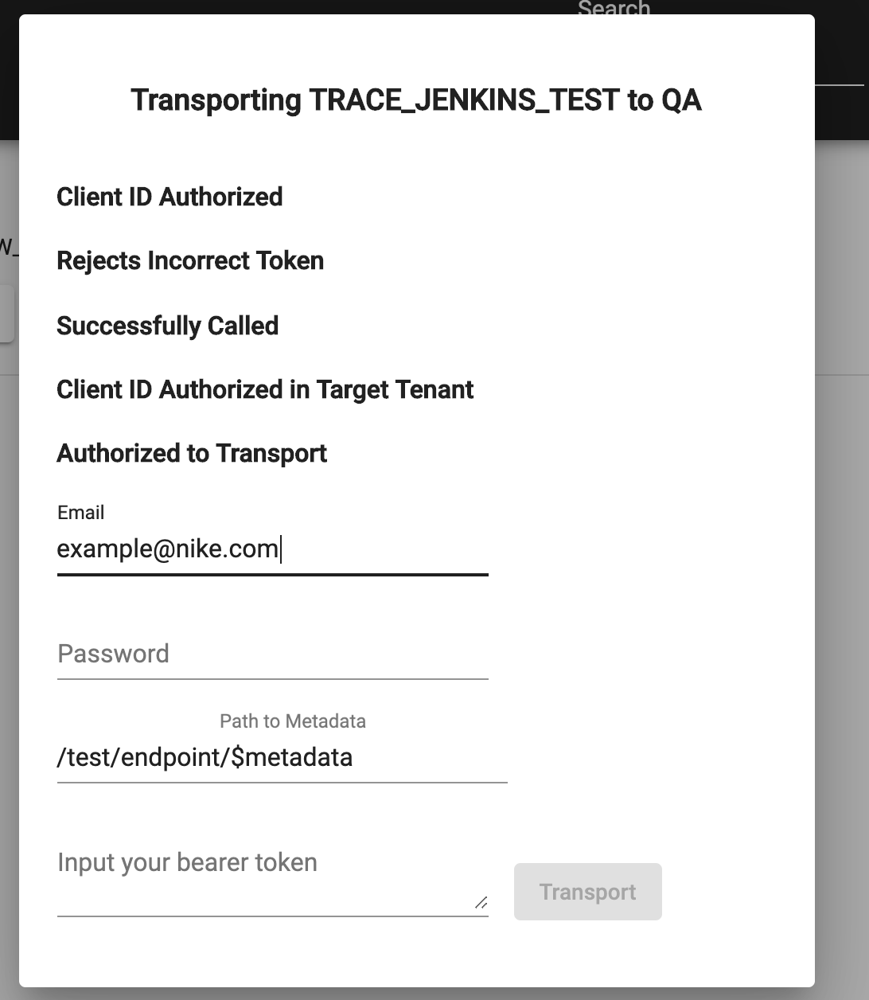

# API Manager Transport Application

### Motiviation
This application gives us some useful functions that supplement the API Manager platform, namely:
1. Visibility into our API Manager tenants and providing the transport process to a wider audience.
2. Version control and change tracking through Github.
3. Automates the generation and publishing of documenation to the Nike developer portal.

### Building

You can build a docker container from this repository using the following command:
```
docker build github.com/trace-andreason/API-Manager-Transport
```

In order for the container to run, it requires a number of environment variables to be set. You can write an environemnt file to set these credentials:
```
SCPI_AUTH={Base64 credentials}
GITHUB_TOKEN={token with read/write access}
UNAUTHORIZEDID_SECRET={Okta secret}
DEVPORTAL_SECRET={Okta secret}
```

### Screenshots
#### Main Screen

#### Search

#### Transport Screen

